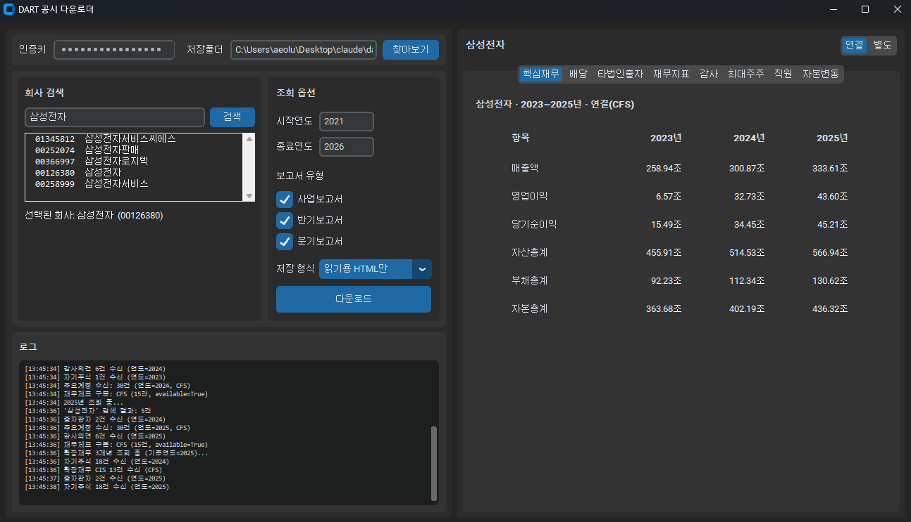

# DART 공시 다운로더 & 재무분석기

금융감독원 **OpenDART API**를 이용해 상장사 공시 원문을 내려받고, 최근 3개년 재무·감사·지배구조 정보를 한 화면에서 비교하는 데스크톱 GUI입니다.



---

## 왜 만들었나

기업 하나를 검토하려면 DART 웹사이트에서 이 과정을 반복해야 합니다.

1. 회사명 검색 → 공시목록에서 사업보고서 찾기
2. 뷰어를 열어 재무제표 탭을 찾아 들어가기
3. 필요한 숫자를 눈으로 읽고 엑셀에 옮겨 적기
4. **연도를 바꿔서 1~3번을 다시** → 3개년 비교하려면 3배

여기서 시간을 잡아먹는 건 분석이 아니라 **수집과 전사(轉寫)**입니다. 게다가 손으로 옮기다 보면 오타가 섞이는데, 재무 데이터에서 오타는 곧 결론의 오류입니다.

이 도구는 회사명을 입력하면 **3개년치를 한 번에 조회해 표로 정렬**합니다. 원문 XML도 함께 받아두므로 숫자의 출처를 언제든 역추적할 수 있습니다.

## 무엇을 하나

**공시 원문 다운로드** — 회사명·기간·보고서 종류로 검색해 DART 원문(XML)을 일괄 저장하고, **왼쪽 목차에서 클릭하면 해당 장으로 바로 가는 HTML**로 변환합니다. 사업·반기·분기보고서(정기공시)뿐 아니라 **감사보고서 단독공시**도 받을 수 있어, 사업보고서를 제출하지 않는 **비상장 외부감사대상 법인**의 재무제표·주석 원문까지 확보됩니다. 파일은 `사업보고서_2024.html`, `연결감사보고서_2025.html`처럼 접수번호가 아닌 사람이 읽을 수 있는 이름으로 저장됩니다.

- 좌측 목차와 본문의 주석 참조(`(주석3,4)`)를 누르면 해당 위치로 즉시 이동합니다.
  사업보고서처럼 연결·별도 주석이 따로 있는 문서는 참조가 놓인 재무제표에 맞는
  주석으로 갑니다.

**3개년 재무분석 — 8개 탭**

| 탭 | 내용 |
|---|---|
| 핵심재무 | 매출액 · 영업이익 · 당기순이익 · 자산/부채/자본총계 |
| 재무지표 | 영업이익률 · 순이익률 · 부채비율 · ROE · ROA · 매출총이익률 · 매출원가율 · 총포괄이익률 |
| 배당 | 주당배당금 · 배당성향 · 시가배당률 |
| 감사 | 감사의견 · 감사인 · 강조사항 |
| 최대주주 | 최대주주 및 특수관계인 지분 현황 |
| 타법인출자 | 출자 목적 · 지분율 · 장부가액 |
| 직원 | 직원 수 · 평균근속연수 · 1인당 급여 |
| 자본변동 | 증자 · 감자 이력 |

모든 탭은 **연결/별도 재무제표 구분**과 **기준 연도**를 헤더에 표시합니다. 어떤 숫자를 보고 있는지 헷갈리면 분석이 무의미해지기 때문입니다.

---

## 기술적으로 까다로웠던 지점

포트폴리오 관점에서 이 프로젝트의 핵심은 API 호출이 아니라, **공공 API를 실제로 쓸 때 만나는 문제들**을 해결한 부분입니다.

### 1. DART 원문 XML은 표준 XML이 아니다 — `fix_xml()`

DART가 내려주는 공시 원문은 파서에 그대로 넣으면 **깨집니다.** 본문 텍스트에 이스케이프되지 않은 `&`와 `<`가 날것으로 섞여 있기 때문입니다 (`주식회사 A & B`, `매출 < 10억` 같은 표현).

단순 치환(`&` → `&amp;`)으로는 풀 수 없습니다. 이미 정상인 `&amp;`가 `&amp;amp;`로 이중 인코딩되고, 진짜 태그의 `<`까지 망가뜨리기 때문입니다.

그래서 **문자 단위로 순회하며 컨텍스트를 추적하는 파서**를 직접 작성했습니다.

- 태그 구조 / 텍스트 구간 / 속성값 구간을 상태로 구분
- 유효한 entity(`&amp;` `&#123;`)는 정규식으로 먼저 매칭해 보존
- CDATA · 주석 · 처리 지시(`<?xml ?>`)는 통째로 건너뛰기
- 텍스트 구간의 날것 `&`, 비태그 `<`만 선별 이스케이프

### 2. 본문에 쓰인 `<HL036>`이 태그로 오인된다 — `_scan_real_tags()`

`fix_xml()`을 통과한 뒤에도 실제 보고서 17건이 **전부** `mismatched tag`로 파싱에 실패했습니다. 원인은 제약사 보고서 본문의 이 표기였습니다.

```xml
<TD ...><HL036>중국 임상3상<HL161>중국 임상3상</TD>
```

`HL036`·`HL161`은 신약 후보물질 코드입니다. 사람이 꺾쇠로 감싸 적은 **텍스트**인데, 생김새가 태그와 구별되지 않아 파서가 열린 태그로 읽고 죽습니다. 태그 이름 목록을 미리 알 수 없으니(회사마다 다른 약어를 씁니다) 문서 자체에서 판별하기로 했습니다.

- 1패스 — 문서 전체에서 **닫는 태그(`</X>`)나 자기완결 태그(`<X/>`)로 한 번이라도 등장한 이름**을 수집
- 2패스 — 그 목록에 없는 이름은 태그가 아니라 본문 텍스트로 보고 `&lt;`로 이스케이프

닫히는 법이 없는 이름은 태그일 수 없다는 성질만 쓰므로, 어떤 약어가 나오든 통합니다. 덤으로 DART가 줄바꿈에 쓰는 비표준 엔티티 `&cr;`(한 문서에 6,000개 넘게 나옵니다)도 이 단계에서 줄바꿈 표식으로 바꿔 HTML의 `<br>`로 폅니다.

### 3. "에스케이하이닉스"로 검색하면 안 나온다 — `search_company()`

DART에 등록된 법인명은 `SK하이닉스`인데, 사용자는 `에스케이하이닉스`라고 칩니다. 한글 표기와 영문 약칭이 섞여 쓰이는 국내 기업 특성입니다.

에스케이→SK, 엘지→LG, 씨제이→CJ, 케이티→KT 등 **한글 음차 ↔ 영문 약칭 매핑**을 두어 양방향으로 검색되게 했습니다.

### 4. 계정과목명이 회사마다 다르다 — `_find_account()`

같은 항목인데도 회사·연도별로 `매출액` / `수익(매출액)` / `영업수익`처럼 이름이 제각각입니다. 정확히 일치하는 이름만 찾으면 조회가 빈 값으로 나옵니다. 후보군을 두고 유연하게 매칭하도록 처리했습니다.

### 5. 비상장 외감법인은 사업보고서가 아예 없다 — `list_disclosures()`

DART 조회에서 흔히 막히는 지점입니다. 정기공시(`pblntf_ty=A`)만 조회하면 비상장 외부감사대상 법인은 **결과가 0건**이고, OpenDART는 이때 `status=013`을 내려줍니다. 이걸 오류로 처리하면 "조회 실패"로 보이지만, 사실은 *그 경로에 문서가 없을 뿐*입니다.

이런 법인의 재무제표·주석은 **외부감사관련 공시(`pblntf_ty=F`)의 감사보고서 단독공시**에 들어 있습니다. 그래서

- 보고서 유형에 따라 조회할 공시유형을 나눠 부르고(정기공시 → `A`, 감사보고서 → `F`) 결과를 접수번호 기준으로 병합
- `013`은 예외가 아니라 **빈 결과**로 처리하고, 대신 "감사보고서를 체크하라"는 안내를 남김
- `total_page`를 따라 전체 페이지를 수집 (기간을 길게 잡으면 100건을 넘습니다)

### 6. 폴더당 마커 하나로는 부족하다 — `download_document()`

완료 마커를 폴더 단위(`.done`)로 두면, **같은 해에 같은 종류의 공시가 둘 이상**일 때 뒤엣것이 통째로 스킵됩니다. 1분기·3분기 보고서가 그렇고, 별도·연결 감사보고서가 그렇습니다. 마커를 접수번호별(`.done_20250404003784`)로 바꿔 해결했습니다. 구버전으로 받아둔 폴더는 해당 접수번호 파일이 실제로 있는지 확인해 완료로 인정하므로, 다시 받지 않습니다.

### 7. 그 밖의 설계 결정

- **캐싱** — 전체 회사목록(`CORPCODE.xml`, 30MB)은 최초 1회만 받아 재사용
- **중단 지점 복구** — 접수번호별 `.done_` 마커를 남겨 재실행 시 건너뜀
- **UI 블로킹 방지** — 네트워크 작업은 별도 스레드에서 돌리고 로그를 실시간 전달
- **엔진/UI 분리** — `dart_engine.py`는 GUI를 전혀 모릅니다. `log_fn` 콜백만 주입받아 CLI에서도 그대로 재사용 가능

---

## 설치 및 실행

**요구사항** — Python 3.10+, DART OpenAPI 인증키 ([무료 발급](https://opendart.fss.or.kr/))

```bash
git clone https://github.com/joongpark0902/dart-downloader.git
cd dart-downloader
pip install -r requirements.txt
python dart_gui.py
```

인증키는 실행 후 GUI 상단 입력창에 붙여넣고 **[저장]**을 누르면 실행파일 옆 `config.txt`에 보관되어 다음 실행부터 자동으로 채워집니다. 이 파일은 `.gitignore`에 들어 있습니다.

### probe 스크립트 실행 (선택)

`scripts/`에는 개발 과정에서 API 동작을 하나씩 검증한 스크립트가 단계별로 남아 있습니다. 이쪽은 환경변수로 키를 받습니다.

```bash
# Windows PowerShell
$env:DART_API_KEY = "발급받은_인증키"
python scripts/test_engine.py
```

| 스크립트 | 검증 내용 |
|---|---|
| `step1_download_corpcode.py` | 회사 고유번호 목록 다운로드 · 압축 해제 |
| `step2_search_company.py` | 회사명 검색 |
| `step3_list_disclosures.py` | 공시목록 조회 · 정정보고서 필터링 |
| `step4_download_document.py` | 원문 다운로드 · 중복 방지 |
| `step5_peek_raw.py` | XML 보정 로직 검증 |
| `step_diagnose.py` | 비상장사 등 예외 케이스 진단 |
| `step6_audit_report.py` | 감사보고서 단독공시(`pblntf_ty=F`) 경로 검증 |
| `test_engine.py` | 엔진 전체 흐름 통합 검증 |

---

## 파일 구조

| 파일 | 역할 |
|---|---|
| `app.py` | 진입점. 창 셸과 공유 상태 |
| `settings.py` | 실행 경로·인증키 저장 |
| `ui_theme.py` | 테마·공통 위젯 스타일·표시 포맷 |
| `download_tab.py` | 좌측 다운로드 패널 (검색·조회옵션·로그) |
| `analysis_tab.py` | 우측 분석 패널 (탭 컨테이너·연결/별도 토글) |
| `analysis/` | 분석 탭 8개 (재무지표·재무비율·배당·타법인출자·감사의견·주주현황·직원현황·자본변동) |
| `dart_client.py` | CORPCODE 로드·회사 검색·공시 목록 조회 |
| `downloader.py` | 문서 다운로드·압축해제·파일명 정리 |
| `financials.py` | 재무 API 파싱·3개년 집계·비율 계산 |
| `dart_viewer.py` | DART XML → 읽기용 HTML (목차 포함) |
| `note_links.py` | 주석 참조를 주석 본문으로 잇는 링크 생성 |
| `xml_fix.py` | DART 비표준 XML 보정 |
| `dart_engine.py`, `dart_gui.py` | 이전 이름 호환용 shim |

`scripts/` 아래 단계별 도구는 `dart_engine` shim을 통해 그대로 동작합니다.

**의존성** — `requests`, `customtkinter` 두 개뿐입니다. 나머지는 표준 라이브러리(`xml.etree`, `zipfile`, `threading`)로 해결했습니다.

## 한계

- **비상장사는 제한적으로 지원됩니다.** 사업보고서 미제출 법인은 재무 API(`fnlttSinglAcnt` 등)가 데이터를 주지 않아 우측 분석 탭이 비어 있습니다. 대신 '감사보고서'를 체크하면 원문 다운로드는 정상 동작하며, 재무제표·주석은 그 원문 안에 들어 있습니다
- 재무 조회는 **12월 결산 법인** 기준입니다
- OpenDART API는 **일 20,000건** 호출 제한이 있습니다

## 라이선스

MIT

---

DART 공시 데이터의 저작권은 금융감독원에 있습니다. 이 도구는 공개 API를 통한 조회 편의를 제공할 뿐이며, 조회 결과의 정확성을 보증하지 않습니다. 투자 판단의 근거로 사용하기 전 반드시 원문을 확인하십시오.
